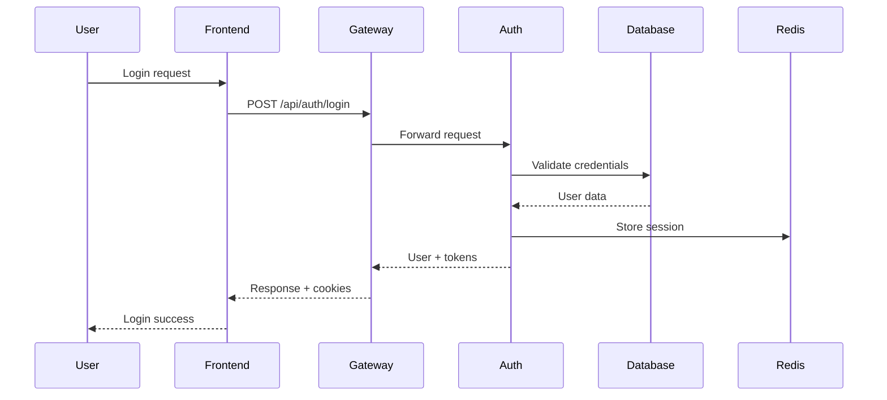
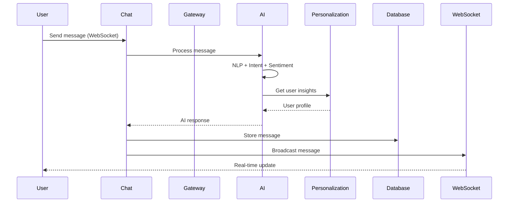
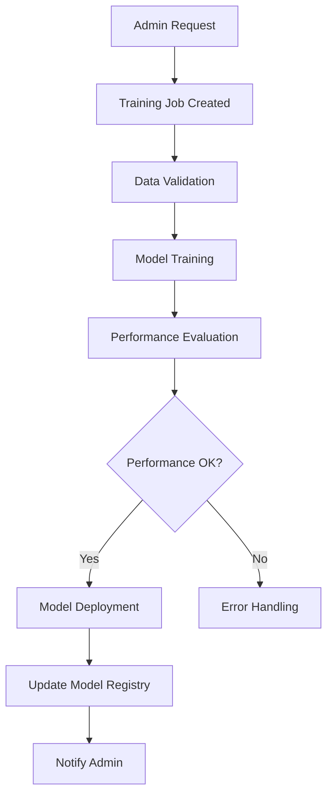
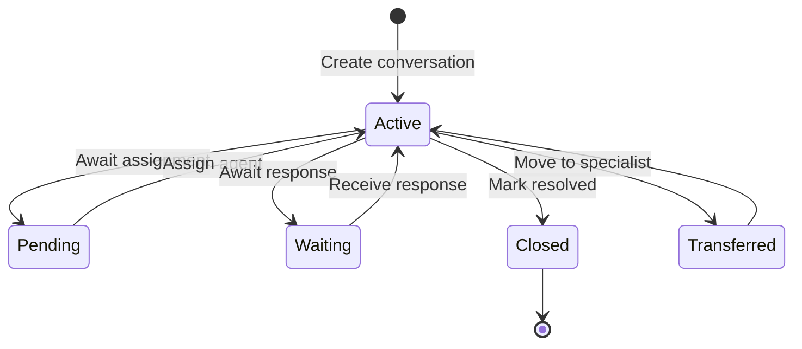
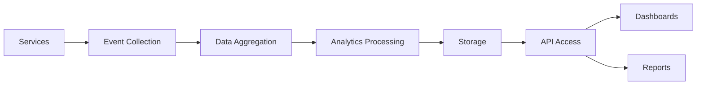

# API Specifications and Data Flow Documentation

## Table of Contents
1. [API Gateway Overview](#api-gateway-overview)
2. [Authentication Endpoints](#authentication-endpoints)
3. [Chat Endpoints](#chat-endpoints)
4. [AI Processing Endpoints](#ai-processing-endpoints)
5. [Admin Endpoints](#admin-endpoints)
6. [Data & Analytics Endpoints](#data--analytics-endpoints)
7. [Personalization Endpoints](#personalization-endpoints)
8. [WebSocket Events](#websocket-events)
9. [Data Flow Diagrams](#data-flow-diagrams)
10. [Error Handling](#error-handling)
11. [Rate Limiting](#rate-limiting)
12. [Integration Patterns](#integration-patterns)

---

## API Gateway Overview

### Base URL
- **Development**: `http://localhost:8080`
- **Production**: `https://api.chatbot-app.com`

### Headers
All API requests require:
```http
Content-Type: application/json
Accept: application/json
```

Authenticated requests require:
```http
Authorization: Bearer <jwt_token>
X-CSRF-Token: <csrf_token>  // For state-changing operations
```

### Response Format
All API responses follow a consistent format:

#### Success Response
```json
{
  "success": true,
  "data": { ... },
  "meta": {
    "timestamp": "2024-01-01T12:00:00Z",
    "request_id": "uuid-string",
    "pagination": {
      "page": 1,
      "limit": 20,
      "total": 100,
      "pages": 5
    }
  }
}
```

#### Error Response
```json
{
  "success": false,
  "error": {
    "code": "VALIDATION_ERROR",
    "message": "Invalid input data",
    "details": {
      "field": "email",
      "reason": "Invalid email format"
    }
  },
  "meta": {
    "timestamp": "2024-01-01T12:00:00Z",
    "request_id": "uuid-string"
  }
}
```

---

## Authentication Endpoints

### POST /api/auth/login
Authenticate user with email/password.

#### Request
```json
{
  "email": "user@example.com",
  "password": "password123",
  "remember_me": false
}
```

#### Response
```json
{
  "success": true,
  "data": {
    "user": {
      "id": "user-uuid",
      "email": "user@example.com",
      "name": "John Doe",
      "role": "user",
      "avatar_url": "https://example.com/avatar.jpg"
    },
    "token": {
      "access_token": "eyJhbGciOiJIUzI1NiIs...",
      "refresh_token": "eyJhbGciOiJIUzI1NiIs...",
      "token_type": "Bearer",
      "expires_in": 3600
    }
  },
  "meta": {}
}
```

#### Errors
- `400` - Invalid credentials
- `429` - Too many login attempts
- `500` - Server error

### POST /api/auth/register
Register new user account.

#### Request
```json
{
  "email": "newuser@example.com",
  "password": "securepassword123",
  "name": "New User",
  "terms_accepted": true,
  "marketing_consent": false
}
```

#### Response
```json
{
  "success": true,
  "data": {
    "user": {
      "id": "user-uuid",
      "email": "newuser@example.com",
      "name": "New User",
      "role": "user",
      "email_verified": false
    },
    "message": "Registration successful. Please check your email for verification."
  }
}
```

### GET /api/auth/profile
Get current user profile.

#### Headers
```http
Authorization: Bearer <jwt_token>
```

#### Response
```json
{
  "success": true,
  "data": {
    "id": "user-uuid",
    "email": "user@example.com",
    "name": "John Doe",
    "role": "user",
    "preferences": {
      "language": "en",
      "theme": "light",
      "notifications": {
        "email": true,
        "push": false
      }
    },
    "created_at": "2024-01-01T00:00:00Z",
    "last_login": "2024-01-01T12:00:00Z"
  }
}
```

### PUT /api/auth/profile
Update user profile.

#### Request
```json
{
  "name": "John Smith",
  "preferences": {
    "language": "en",
    "theme": "dark",
    "notifications": {
      "email": true,
      "push": true
    }
  }
}
```

### POST /api/auth/logout
Logout user and invalidate tokens.

#### Headers
```http
Authorization: Bearer <jwt_token>
X-CSRF-Token: <csrf_token>
```

### OAuth Endpoints

#### GET /api/auth/oauth/google
Initiate Google OAuth flow.

#### Response
Redirects to Google OAuth consent screen.

#### GET /api/auth/oauth/google/callback
Google OAuth callback endpoint.

#### Query Parameters
```http
?code=AUTH_CODE&state=CSRF_STATE
```

#### Response
```json
{
  "success": true,
  "data": {
    "user": { ... },
    "token": { ... },
    "is_new_user": false
  }
}
```

Similar endpoints exist for:
- `/api/auth/oauth/github`
- `/api/auth/oauth/microsoft`

---

## Chat Endpoints

### GET /api/chat/conversations
Get user's conversations.

#### Query Parameters
- `page` (integer): Page number (default: 1)
- `limit` (integer): Items per page (default: 20, max: 100)
- `status` (string): Filter by status ('active', 'closed', 'archived')
- `search` (string): Search in conversation titles

#### Response
```json
{
  "success": true,
  "data": [
    {
      "id": "conv-uuid",
      "title": "Customer Support Chat",
      "status": "active",
      "participant_count": 2,
      "message_count": 25,
      "last_message": {
        "id": "msg-uuid",
        "content": "How can I help you today?",
        "sender": "admin",
        "created_at": "2024-01-01T12:00:00Z"
      },
      "created_at": "2024-01-01T10:00:00Z",
      "updated_at": "2024-01-01T12:00:00Z"
    }
  ],
  "meta": {
    "pagination": {
      "page": 1,
      "limit": 20,
      "total": 50,
      "pages": 3
    }
  }
}
```

### POST /api/chat/conversations
Create new conversation.

#### Request
```json
{
  "title": "Support Request",
  "message": "I need help with my account",
  "priority": "normal",
  "category": "support"
}
```

#### Response
```json
{
  "success": true,
  "data": {
    "id": "conv-uuid",
    "title": "Support Request",
    "status": "active",
    "priority": "normal",
    "category": "support",
    "participants": [
      {
        "id": "user-uuid",
        "name": "John Doe",
        "role": "user"
      }
    ],
    "messages": [
      {
        "id": "msg-uuid",
        "content": "I need help with my account",
        "sender": "user",
        "message_type": "text",
        "created_at": "2024-01-01T12:00:00Z"
      }
    ]
  }
}
```

### GET /api/chat/conversations/:id
Get conversation details.

#### Response
```json
{
  "success": true,
  "data": {
    "id": "conv-uuid",
    "title": "Support Request",
    "status": "active",
    "metadata": {
      "priority": "normal",
      "category": "support",
      "tags": ["billing", "account"]
    },
    "participants": [
      {
        "id": "user-uuid",
        "name": "John Doe",
        "role": "user",
        "avatar_url": "https://example.com/avatar.jpg"
      },
      {
        "id": "admin-uuid",
        "name": "Support Agent",
        "role": "admin",
        "avatar_url": "https://example.com/admin-avatar.jpg"
      }
    ],
    "messages": [ ... ],
    "created_at": "2024-01-01T10:00:00Z",
    "updated_at": "2024-01-01T12:00:00Z"
  }
}
```

### POST /api/chat/conversations/:id/messages
Send message in conversation.

#### Request
```json
{
  "content": "Thank you for your help!",
  "message_type": "text",
  "attachments": [
    {
      "type": "image",
      "url": "https://example.com/image.jpg",
      "name": "screenshot.png",
      "size": 102400
    }
  ],
  "reply_to": "msg-uuid" // Optional: reply to specific message
}
```

#### Response
```json
{
  "success": true,
  "data": {
    "id": "msg-uuid",
    "conversation_id": "conv-uuid",
    "content": "Thank you for your help!",
    "sender": {
      "id": "user-uuid",
      "name": "John Doe",
      "role": "user"
    },
    "message_type": "text",
    "attachments": [ ... ],
    "reply_to": "msg-uuid",
    "metadata": {
      "ai_processed": true,
      "sentiment": "positive",
      "intent": "gratitude"
    },
    "created_at": "2024-01-01T12:00:00Z"
  }
}
```

### GET /api/chat/conversations/:id/messages
Get conversation messages with pagination.

#### Query Parameters
- `page` (integer): Page number
- `limit` (integer): Messages per page (default: 50, max: 100)
- `before` (string): Get messages before this message ID
- `after` (string): Get messages after this message ID

### PUT /api/chat/conversations/:id
Update conversation.

#### Request
```json
{
  "title": "Updated Title",
  "status": "closed",
  "priority": "high",
  "tags": ["urgent", "billing"]
}
```

### DELETE /api/chat/conversations/:id
Delete/archive conversation.

---

## AI Processing Endpoints

### POST /api/ai/process-message
Process message through complete AI pipeline.

#### Request
```json
{
  "message": "I need help with my billing issue",
  "user_id": "user-uuid",
  "conversation_id": "conv-uuid",
  "context": {
    "previous_intent": "help_request",
    "user_tier": "premium",
    "session_duration": 300
  }
}
```

#### Response
```json
{
  "success": true,
  "data": {
    "response": "I'd be happy to help you with your billing issue. Could you please provide more details about the specific problem you're experiencing?",
    "confidence": 0.95,
    "intent": "billing_help",
    "sentiment": "neutral",
    "entities": [
      {
        "type": "service",
        "value": "billing",
        "confidence": 0.98,
        "start": 19,
        "end": 26
      }
    ],
    "suggestions": [
      "Check my invoice",
      "Update payment method",
      "Cancel subscription"
    ],
    "ai_metadata": {
      "model_version": "v2.1.0",
      "processing_time_ms": 245,
      "tokens_used": 150,
      "confidence_scores": {
        "intent": 0.95,
        "sentiment": 0.87,
        "entities": 0.92
      }
    }
  }
}
```

### POST /api/ai/intent
Recognize intent from message.

#### Request
```json
{
  "message": "I want to cancel my subscription",
  "user_id": "user-uuid",
  "context": {
    "user_history": ["upgrade_request", "billing_question"]
  }
}
```

#### Response
```json
{
  "success": true,
  "data": {
    "intent": "subscription_cancel",
    "confidence": 0.94,
    "alternatives": [
      {
        "intent": "subscription_manage",
        "confidence": 0.78
      }
    ],
    "entities": [
      {
        "type": "action",
        "value": "cancel",
        "confidence": 0.96
      },
      {
        "type": "service",
        "value": "subscription",
        "confidence": 0.92
      }
    ],
    "metadata": {
      "model": "intent_classifier_v2.1.0",
      "processing_time_ms": 120
    }
  }
}
```

### POST /api/ai/sentiment
Analyze sentiment of message.

#### Request
```json
{
  "message": "I'm really frustrated with this billing issue!",
  "user_id": "user-uuid",
  "conversation_id": "conv-uuid"
}
```

#### Response
```json
{
  "success": true,
  "data": {
    "sentiment": "negative",
    "confidence": 0.91,
    "scores": {
      "positive": 0.05,
      "neutral": 0.08,
      "negative": 0.87
    },
    "emotions": [
      {
        "emotion": "frustration",
        "intensity": 0.89,
        "confidence": 0.85
      },
      {
        "emotion": "anger",
        "intensity": 0.65,
        "confidence": 0.72
      }
    ],
    "sentiment_trend": "stable",
    "metadata": {
      "model": "sentiment_analyzer_v1.8.2",
      "processing_time_ms": 95
    }
  }
}
```

### POST /api/ai/generate-response
Generate AI response based on context.

#### Request
```json
{
  "message": "I need help with my account",
  "intent": "account_help",
  "entities": [
    {
      "type": "service",
      "value": "account"
    }
  ],
  "sentiment": "neutral",
  "user_id": "user-uuid",
  "conversation_id": "conv-uuid",
  "context": {
    "user_tier": "premium",
    "previous_conversations": 5,
    "language": "en"
  },
  "options": {
    "response_length": "medium",
    "tone": "helpful",
    "include_suggestions": true
  }
}
```

#### Response
```json
{
  "success": true,
  "data": {
    "response": "I'd be happy to help you with your account! As a premium member, you have access to priority support. What specific account issue are you experiencing?",
    "confidence": 0.96,
    "suggestions": [
      "Reset password",
      "Update profile",
      "View billing history"
    ],
    "follow_up_questions": [
      "What type of account issue are you having?",
      "Are you trying to access your account online or through our mobile app?"
    ],
    "personalization": {
      "user_tier_referenced": true,
      "personalized_language": true,
      "context_aware": true
    },
    "metadata": {
      "model": "response_generator_v3.0.1",
      "processing_time_ms": 180,
      "tokens_generated": 85
    }
  }
}
```

### GET /api/ai/models
Get available AI models.

#### Response
```json
{
  "success": true,
  "data": [
    {
      "name": "intent_classifier",
      "version": "v2.1.0",
      "type": "classification",
      "status": "active",
      "accuracy": 0.94,
      "last_updated": "2024-01-01T00:00:00Z",
      "metrics": {
        "precision": 0.93,
        "recall": 0.95,
        "f1_score": 0.94
      }
    },
    {
      "name": "sentiment_analyzer",
      "version": "v1.8.2",
      "type": "sentiment",
      "status": "active",
      "accuracy": 0.89,
      "last_updated": "2024-01-01T00:00:00Z"
    }
  ]
}
```

### POST /api/ai/train
Train custom AI model.

#### Request
```json
{
  "model_name": "customer_support_classifier",
  "model_type": "intent_classification",
  "training_data": [
    {
      "text": "I need help with my password",
      "intent": "password_help",
      "confidence": 1.0
    },
    {
      "text": "How do I reset my password?",
      "intent": "password_help",
      "confidence": 1.0
    }
  ],
  "validation_data": [ ... ],
  "options": {
    "epochs": 50,
    "learning_rate": 0.001,
    "batch_size": 32,
    "test_size": 0.2
  }
}
```

#### Response
```json
{
  "success": true,
  "data": {
    "job_id": "train-job-uuid",
    "status": "queued",
    "message": "Training job queued successfully",
    "estimated_duration": "15-30 minutes",
    "webhook_url": "https://api.chatbot-app.com/webhooks/training"
  }
}
```

---

## Admin Endpoints

### GET /api/admin/users
Get users with admin privileges.

#### Query Parameters
- `page`, `limit`: Pagination
- `role` (string): Filter by role ('user', 'admin', 'super_admin')
- `status` (string): Filter by status ('active', 'inactive', 'suspended')
- `search` (string): Search by name or email
- `date_from`, `date_to`: Filter by registration date

#### Response
```json
{
  "success": true,
  "data": [
    {
      "id": "user-uuid",
      "email": "user@example.com",
      "name": "John Doe",
      "role": "user",
      "status": "active",
      "conversations_count": 15,
      "last_login": "2024-01-01T12:00:00Z",
      "created_at": "2024-01-01T00:00:00Z",
      "profile": {
        "avatar_url": "https://example.com/avatar.jpg",
        "location": "New York, US",
        "timezone": "America/New_York"
      }
    }
  ],
  "meta": {
    "pagination": { ... },
    "summary": {
      "total_users": 1250,
      "active_users": 980,
      "new_users_today": 12,
      "new_users_week": 89
    }
  }
}
```

### PUT /api/admin/users/:id
Update user with admin privileges.

#### Request
```json
{
  "name": "John Smith",
  "role": "admin",
  "status": "active",
  "notes": "VIP customer - provide premium support"
}
```

### DELETE /api/admin/users/:id
Delete/deactivate user account.

### GET /api/admin/conversations
Get all conversations with admin view.

#### Response
```json
{
  "success": true,
  "data": [
    {
      "id": "conv-uuid",
      "title": "Billing Issue",
      "status": "active",
      "priority": "high",
      "assignee": {
        "id": "admin-uuid",
        "name": "Support Agent",
        "avatar_url": "https://example.com/agent-avatar.jpg"
      },
      "customer": {
        "id": "user-uuid",
        "name": "John Doe",
        "email": "user@example.com",
        "tier": "premium"
      },
      "metrics": {
        "message_count": 25,
        "response_time_avg": 180,
        "customer_satisfaction": 4.5
      },
      "tags": ["billing", "urgent", "premium"],
      "created_at": "2024-01-01T10:00:00Z",
      "updated_at": "2024-01-01T12:00:00Z"
    }
  ],
  "meta": {
    "pagination": { ... },
    "filters": {
      "statuses": ["active", "pending", "closed"],
      "priorities": ["low", "normal", "high", "urgent"],
      "assignees": ["admin-uuid-1", "admin-uuid-2"]
    }
  }
}
```

### PUT /api/admin/conversations/:id/assign
Assign conversation to admin.

#### Request
```json
{
  "admin_id": "admin-uuid",
  "priority": "high",
  "notes": "Customer is frustrated, escalate to senior agent"
}
```

### POST /api/admin/export
Export data in various formats.

#### Request
```json
{
  "type": "conversations",
  "format": "csv",
  "date_range": {
    "from": "2024-01-01T00:00:00Z",
    "to": "2024-01-31T23:59:59Z"
  },
  "filters": {
    "status": "closed",
    "tags": ["billing"]
  },
  "include_metadata": true
}
```

#### Response
```json
{
  "success": true,
  "data": {
    "export_id": "export-uuid",
    "status": "processing",
    "download_url": null,
    "estimated_completion": "2024-01-01T12:05:00Z",
    "record_count": 1547
  }
}
```

### GET /api/admin/analytics
Get comprehensive admin analytics.

#### Response
```json
{
  "success": true,
  "data": {
    "overview": {
      "total_conversations": 15240,
      "active_conversations": 145,
      "total_users": 1250,
      "new_users_today": 12,
      "avg_response_time": 180,
      "customer_satisfaction": 4.2
    },
    "trends": {
      "conversations_by_day": [
        {
          "date": "2024-01-01",
          "count": 245,
          "avg_response_time": 175
        }
      ],
      "user_engagement": [
        {
          "date": "2024-01-01",
          "active_users": 850,
          "new_registrations": 12,
          "retention_rate": 0.85
        }
      ]
    },
    "ai_performance": {
      "intent_accuracy": 0.94,
      "sentiment_accuracy": 0.89,
      "response_quality": 0.87,
      "automation_rate": 0.65
    }
  }
}
```

---

## Data & Analytics Endpoints

### GET /api/data/analytics
Get analytics data for specified metrics.

#### Query Parameters
- `metric_type` (string): Type of metric
- `date_range` (string): Date range ('today', 'week', 'month', 'custom')
- `group_by` (string): Grouping ('hour', 'day', 'week', 'month')
- `filters` (object): Additional filters

#### Response
```json
{
  "success": true,
  "data": {
    "metrics": [
      {
        "metric_type": "conversation_volume",
        "value": 245,
        "timestamp": "2024-01-01T12:00:00Z",
        "metadata": {
          "channel": "web",
          "region": "us-east"
        }
      }
    ],
    "summary": {
      "total_volume": 15240,
      "growth_rate": 0.15,
      "peak_hour": 14,
      "average_daily": 492
    },
    "breakdown": {
      "by_channel": {
        "web": 0.65,
        "mobile": 0.25,
        "api": 0.10
      },
      "by_region": {
        "us-east": 0.45,
        "us-west": 0.30,
        "eu": 0.25
      }
    }
  }
}
```

### POST /api/data/ab-test
Create A/B test configuration.

#### Request
```json
{
  "name": "Response Time Optimization",
  "description": "Test impact of faster response times on satisfaction",
  "traffic_split": {
    "control": 0.5,
    "variant": 0.5
  },
  "metrics": [
    "response_time",
    "satisfaction_score",
    "conversation_completion"
  ],
  "duration_days": 14,
  "target_audience": {
    "user_tiers": ["premium", "enterprise"],
    "regions": ["us-east", "us-west"]
  },
  "success_criteria": {
    "minimum_sample_size": 1000,
    "confidence_level": 0.95,
    "minimum_effect_size": 0.05
  }
}
```

#### Response
```json
{
  "success": true,
  "data": {
    "test_id": "ab-test-uuid",
    "status": "active",
    "start_date": "2024-01-01T00:00:00Z",
    "end_date": "2024-01-15T00:00:00Z",
    "links": {
      "dashboard": "https://admin.chatbot-app.com/ab-tests/ab-test-uuid",
      "api": "https://api.chatbot-app.com/data/ab-tests/ab-test-uuid"
    }
  }
}
```

### POST /api/data/export
Export data in various formats.

#### Request
```json
{
  "dataset": "user_analytics",
  "format": "xlsx",
  "date_range": {
    "from": "2024-01-01T00:00:00Z",
    "to": "2024-01-31T23:59:59Z"
  },
  "columns": [
    "user_id",
    "conversation_count",
    "avg_session_duration",
    "satisfaction_score"
  ],
  "filters": {
    "user_tier": "premium",
    "min_conversations": 5
  }
}
```

### GET /api/data/backup
Get backup status and create backups.

#### Response
```json
{
  "success": true,
  "data": {
    "last_backup": "2024-01-01T02:00:00Z",
    "backup_status": "completed",
    "backup_size": "2.3 GB",
    "backup_location": "s3://chatbot-backups/2024-01-01/",
    "next_scheduled": "2024-01-02T02:00:00Z",
    "retention_policy": {
      "daily": 7,
      "weekly": 4,
      "monthly": 12
    }
  }
}
```

---

## Personalization Endpoints

### GET /api/personalization/user-profile/:user_id
Get comprehensive user profile for personalization.

#### Response
```json
{
  "success": true,
  "data": {
    "user_id": "user-uuid",
    "profile": {
      "demographics": {
        "age_group": "25-34",
        "location": "San Francisco, CA",
        "timezone": "America/Los_Angeles"
      },
      "behavioral": {
        "preferred_language": "en",
        "communication_style": "formal",
        "response_preference": "detailed",
        "session_patterns": {
          "avg_session_duration": 480,
          "preferred_times": ["10:00", "14:00", "20:00"],
          "activity_days": ["monday", "tuesday", "wednesday", "thursday"]
        }
      },
      "preferences": {
        "topics": ["billing", "technical", "account"],
        "complexity_level": "intermediate",
        "personalization_level": "high"
      }
    },
    "segments": [
      {
        "segment_id": "power_users",
        "name": "Power Users",
        "confidence": 0.89,
        "characteristics": ["high_activity", "premium_tier", "technical"]
      }
    ],
    "insights": {
      "satisfaction_trend": "improving",
      "preferred_resolution_time": "immediate",
      "escalation_risk": "low"
    }
  }
}
```

### POST /api/personalization/recommendations
Get personalized recommendations.

#### Request
```json
{
  "user_id": "user-uuid",
  "context": {
    "current_conversation": "conv-uuid",
    "recent_topics": ["billing", "account"],
    "user_mood": "neutral"
  },
  "types": ["content", "features", "self_service"],
  "limit": 5
}
```

#### Response
```json
{
  "success": true,
  "data": {
    "recommendations": [
      {
        "type": "content",
        "title": "Billing FAQ",
        "description": "Common billing questions and answers",
        "relevance_score": 0.94,
        "reason": "Based on your recent billing inquiries",
        "actions": [
          {
            "type": "link",
            "label": "View FAQ",
            "url": "/help/billing-faq"
          }
        ]
      },
      {
        "type": "feature",
        "title": "Account Dashboard",
        "description": "Manage your account settings and preferences",
        "relevance_score": 0.87,
        "reason": "High engagement users often use this feature",
        "actions": [
          {
            "type": "modal",
            "label": "Open Dashboard",
            "action": "open_dashboard"
          }
        ]
      }
    ],
    "personalization_factors": [
      "user_segment",
      "conversation_history",
      "behavioral_patterns",
      "preferences"
    ]
  }
}
```

### POST /api/personalization/behavior-event
Track user behavior for personalization.

#### Request
```json
{
  "user_id": "user-uuid",
  "event_type": "conversation_action",
  "event_data": {
    "action": "message_sent",
    "conversation_id": "conv-uuid",
    "message_type": "text",
    "content_length": 150,
    "sentiment": "positive",
    "intent": "information_seeking"
  },
  "timestamp": "2024-01-01T12:00:00Z",
  "session_id": "session-uuid"
}
```

### POST /api/personalization/segmentation
Create or update user segments.

#### Request
```json
{
  "segment_name": "High Value Customers",
  "criteria": {
    "rules": [
      {
        "field": "total_conversations",
        "operator": ">",
        "value": 50
      },
      {
        "field": "customer_tier",
        "operator": "in",
        "value": ["premium", "enterprise"]
      }
    ],
    "logic": "AND"
  },
  "auto_assign": true,
  "update_frequency": "daily"
}
```

---

## WebSocket Events

### Connection
```javascript
const socket = io('http://localhost:3002', {
  auth: {
    token: 'jwt_token_here'
  }
});
```

### Client → Server Events

#### join_conversation
```json
{
  "event": "join_conversation",
  "data": {
    "conversation_id": "conv-uuid"
  }
}
```

#### leave_conversation
```json
{
  "event": "leave_conversation",
  "data": {
    "conversation_id": "conv-uuid"
  }
}
```

#### typing_start
```json
{
  "event": "typing_start",
  "data": {
    "conversation_id": "conv-uuid"
  }
}
```

#### typing_stop
```json
{
  "event": "typing_stop",
  "data": {
    "conversation_id": "conv-uuid"
  }
}
```

#### message_send
```json
{
  "event": "message_send",
  "data": {
    "conversation_id": "conv-uuid",
    "content": "Hello, I need help!",
    "message_type": "text",
    "attachments": [ ... ]
  }
}
```

### Server → Client Events

#### conversation_joined
```json
{
  "event": "conversation_joined",
  "data": {
    "conversation_id": "conv-uuid",
    "participants": [ ... ],
    "messages": [ ... ]
  }
}
```

#### conversation_left
```json
{
  "event": "conversation_left",
  "data": {
    "conversation_id": "conv-uuid"
  }
}
```

#### user_joined
```json
{
  "event": "user_joined",
  "data": {
    "conversation_id": "conv-uuid",
    "user": {
      "id": "user-uuid",
      "name": "John Doe",
      "role": "user"
    }
  }
}
```

#### user_left
```json
{
  "event": "user_left",
  "data": {
    "conversation_id": "conv-uuid",
    "user_id": "user-uuid"
  }
}
```

#### typing_start
```json
{
  "event": "typing_start",
  "data": {
    "conversation_id": "conv-uuid",
    "user": {
      "id": "user-uuid",
      "name": "John Doe"
    }
  }
}
```

#### message_received
```json
{
  "event": "message_received",
  "data": {
    "message": {
      "id": "msg-uuid",
      "conversation_id": "conv-uuid",
      "content": "How can I help you today?",
      "sender": {
        "id": "admin-uuid",
        "name": "Support Agent",
        "role": "admin"
      },
      "message_type": "text",
      "created_at": "2024-01-01T12:00:00Z",
      "ai_metadata": {
        "intent": "greeting",
        "sentiment": "positive"
      }
    }
  }
}
```

#### conversation_updated
```json
{
  "event": "conversation_updated",
  "data": {
    "conversation_id": "conv-uuid",
    "changes": {
      "status": "closed",
      "priority": "high"
    },
    "updated_by": {
      "id": "admin-uuid",
      "name": "Support Agent"
    }
  }
}
```

---

## Data Flow Diagrams

### User Authentication Flow


### Message Processing Flow


### AI Training Flow


### Conversation Flow


### Data Analytics Flow


---

## Error Handling

### HTTP Status Codes

#### 2xx Success
- `200 OK` - Request successful
- `201 Created` - Resource created
- `204 No Content` - Success with no response body

#### 4xx Client Errors
- `400 Bad Request` - Invalid request format
- `401 Unauthorized` - Authentication required
- `403 Forbidden` - Insufficient permissions
- `404 Not Found` - Resource not found
- `409 Conflict` - Resource conflict
- `422 Unprocessable Entity` - Validation error
- `429 Too Many Requests` - Rate limit exceeded

#### 5xx Server Errors
- `500 Internal Server Error` - Server error
- `502 Bad Gateway` - Upstream service error
- `503 Service Unavailable` - Service temporarily unavailable
- `504 Gateway Timeout` - Request timeout

### Error Response Examples

#### Validation Error (422)
```json
{
  "success": false,
  "error": {
    "code": "VALIDATION_ERROR",
    "message": "Request validation failed",
    "details": {
      "field": "email",
      "reason": "Invalid email format",
      "value": "invalid-email"
    },
    "validation_errors": [
      {
        "field": "email",
        "message": "Must be a valid email address"
      },
      {
        "field": "password",
        "message": "Must be at least 8 characters"
      }
    ]
  }
}
```

#### Authentication Error (401)
```json
{
  "success": false,
  "error": {
    "code": "UNAUTHORIZED",
    "message": "Authentication required",
    "details": {
      "reason": "Invalid or expired token"
    }
  }
}
```

#### Rate Limit Error (429)
```json
{
  "success": false,
  "error": {
    "code": "RATE_LIMIT_EXCEEDED",
    "message": "Too many requests",
    "details": {
      "limit": 100,
      "window": "15 minutes",
      "retry_after": 300
    }
  }
}
```

### Error Handling Middleware

#### Node.js Express Example
```javascript
// Global error handler
app.use((error, req, res, next) => {
  const errorResponse = {
    success: false,
    error: {
      code: error.code || 'INTERNAL_ERROR',
      message: error.message || 'Something went wrong',
      details: error.details || null
    },
    meta: {
      timestamp: new Date().toISOString(),
      request_id: req.id
    }
  };

  // Log error
  logger.error('API Error', {
    error: error.message,
    stack: error.stack,
    request_id: req.id,
    path: req.path,
    method: req.method
  });

  // Send appropriate status code
  const statusCode = error.statusCode || error.status || 500;
  res.status(statusCode).json(errorResponse);
});
```

#### Python FastAPI Example
```python
@app.exception_handler(HTTPException)
async def http_exception_handler(request: Request, exc: HTTPException):
    return JSONResponse(
        status_code=exc.status_code,
        content={
            "success": False,
            "error": {
                "code": exc.detail.get("code", "HTTP_ERROR"),
                "message": exc.detail.get("message", str(exc.detail)),
                "details": exc.detail.get("details")
            },
            "meta": {
                "timestamp": datetime.utcnow().isoformat(),
                "request_id": getattr(request.state, "request_id", None)
            }
        }
    )
```

---

## Rate Limiting

### Rate Limit Tiers

#### Standard Tier
- **Requests**: 1000 per 15 minutes
- **WebSocket Connections**: 10 per IP
- **Message Rate**: 30 per minute per conversation

#### Premium Tier
- **Requests**: 5000 per 15 minutes
- **WebSocket Connections**: 50 per IP
- **Message Rate**: 100 per minute per conversation

#### Enterprise Tier
- **Requests**: 25000 per 15 minutes
- **WebSocket Connections**: 200 per IP
- **Message Rate**: 500 per minute per conversation

### Rate Limit Headers

#### Response Headers
```http
X-RateLimit-Limit: 1000
X-RateLimit-Remaining: 995
X-RateLimit-Reset: 1640995200
X-RateLimit-Window: 900
```

#### Rate Limit Exceeded Response
```http
HTTP/1.1 429 Too Many Requests
X-RateLimit-Limit: 1000
X-RateLimit-Remaining: 0
X-RateLimit-Reset: 1640995200
Retry-After: 300

{
  "success": false,
  "error": {
    "code": "RATE_LIMIT_EXCEEDED",
    "message": "Rate limit exceeded",
    "details": {
      "limit": 1000,
      "window": "15 minutes",
      "retry_after": 300
    }
  }
}
```

---

## Integration Patterns

### Request-Response Pattern
```javascript
// Synchronous API calls
const response = await axios.post('/api/ai/process-message', {
  message: userMessage,
  context: conversationContext
});
```

### Event-Driven Pattern
```javascript
// WebSocket for real-time updates
socket.on('message_received', (data) => {
  updateUI(data.message);
});

socket.emit('message_send', {
  conversation_id: conversationId,
  content: messageContent
});
```

### Batch Processing Pattern
```python
# Bulk operations for data processing
async def process_analytics_batch(messages):
    batch_size = 100
    for i in range(0, len(messages), batch_size):
        batch = messages[i:i + batch_size]
        await process_batch(batch)
```

### Circuit Breaker Pattern
```javascript
const circuitBreaker = new CircuitBreaker(aiServiceCall, {
  timeout: 3000,
  errorThresholdPercentage: 50,
  resetTimeout: 30000
});

// Use with fallback
const response = await circuitBreaker.fire(requestData)
  .catch(err => fallbackResponse(err));
```

### Retry Pattern
```python
from tenacity import retry, stop_after_attempt, wait_exponential

@retry(
    stop=stop_after_attempt(3),
    wait=wait_exponential(multiplier=1, min=4, max=10)
)
async def call_external_service(data):
    try:
        return await external_api.post(data)
    except TemporaryError:
        raise
```

This comprehensive API specification document provides detailed information about all endpoints, request/response formats, data flows, and integration patterns for the chatbot application. It serves as a complete reference for developers working with the system.